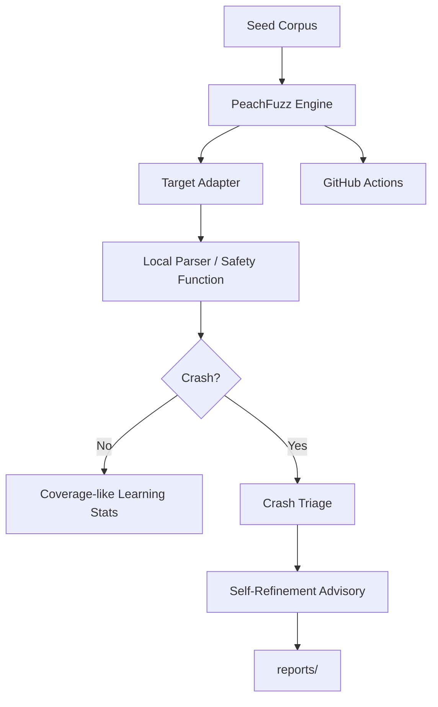

# 🍑 PeachFuzz AI

PeachFuzz AI is a defensive, agentic fuzzing harness for parser, API, and LLM-agent safety testing.

It is designed as a standalone companion project for Hancock by CyberViser / 0AI:

- coverage-guided fuzzing when `atheris` is installed
- deterministic fallback fuzzing when `atheris` is unavailable
- crash triage and self-refinement advisories
- LangGraph-inspired state tracking without requiring LangGraph at runtime
- CI-safe GitHub Actions fuzz smoke tests
- no offensive network activity and no exploit execution

## Safety model

PeachFuzz AI only fuzzes local parser functions and local harness targets. It does not scan networks, exploit targets, run shell payloads, or contact third-party systems.

## Quick start

```bash
python -m venv .venv
source .venv/bin/activate
python -m pip install -e ".[dev,fuzz]"

pytest -q
python -m peachfuzz_ai.cli run --target json --runs 250
python -m peachfuzz_ai.cli run --target findings --runs 250
```

## Atheris mode

```bash
python -m pip install -e ".[fuzz]"
python -m peachfuzz_ai.cli atheris --target json corpus/json_api
```

If `atheris` is not available, use deterministic mode:

```bash
python -m peachfuzz_ai.cli run --target json --runs 1000
```

## GitHub deployment

```bash
gh repo create 0ai-Cyberviser/peachfuzz --public --source=. --remote=origin --push
```

Or with raw git after creating the empty repo:

```bash
git init
git add .
git commit -m "feat: initial PeachFuzz AI harness"
git branch -M main
git remote add origin git@github.com:0ai-Cyberviser/peachfuzz.git
git push -u origin main
```

## Architecture



## Project status

Initial release: `v0.1.0`
