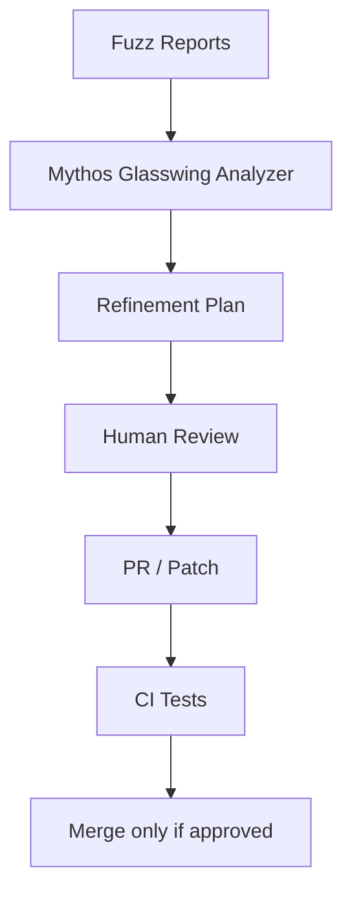

# Mythos Glasswing Mode

Mythos Glasswing is PeachFuzz AI's polished self-refinement profile.

It can:

- analyze local fuzz reports
- classify crash themes
- generate remediation recommendations
- write pull-request text
- suggest regression seeds and tests

It cannot:

- auto-merge
- force-push
- scan networks
- exploit targets
- deliver payloads
- bypass human review

## Run

```bash
python -m peachfuzz_ai.cli run --target json --runs 500 corpus/json_api
python -m peachfuzz_ai.cli refine --report-dir reports --output MYTHOS_GLASSWING_PLAN.md
```

## Review loop


