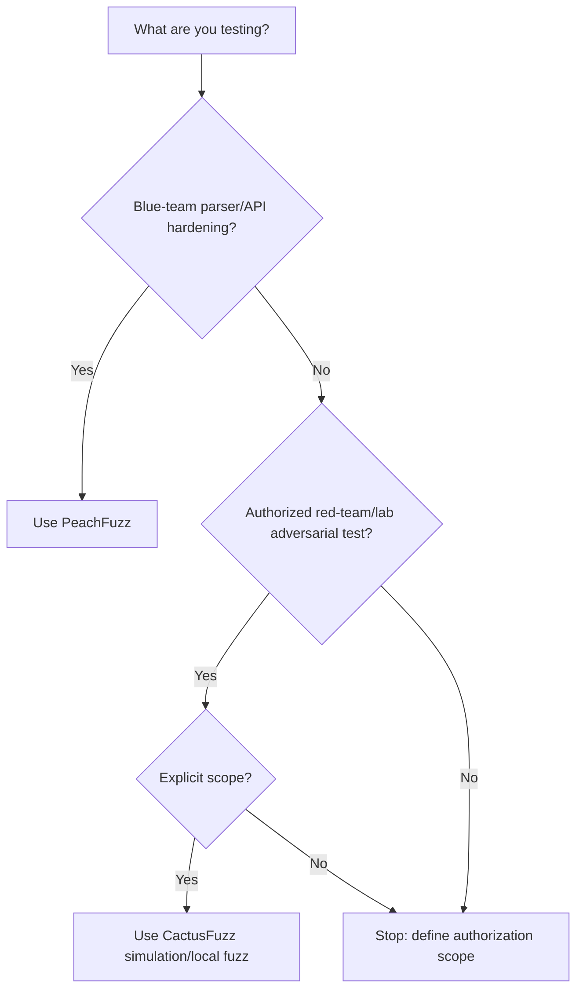

# PeachFuzz / CactusFuzz Split

This repository is now categorized as **peachfuzz-cactusfuzz**.

## Editions

| Edition | Purpose | Default Safety |
|---|---|---|
| PeachFuzz | Defensive blue-team fuzzing for parsers, APIs, webhooks, and guardrails | Local-only, no network, no exploit execution |
| CactusFuzz | Authorized red-team/adversarial fuzzing for owned/lab applications and AI agents | Scope-gated, simulation-first, no unsafe default execution |

## PeachFuzz

PeachFuzz is the blue-team edition.

Use it for:

- parser hardening
- API schema mutation
- webhook validation
- LLM-agent guardrail regression
- CI fuzzing and crash triage

Blocked by default:

- network scanning
- exploit execution
- shell payloads
- third-party callbacks
- credential attacks

## CactusFuzz

CactusFuzz is the authorized red-team/adversarial edition.

Use it for:

- local/lab adversarial agent tests
- prompt-injection resistance testing
- owned-target schema fuzzing
- tool-routing safety checks
- exploitability hypothesis reporting without payload delivery

CactusFuzz still blocks unsafe real-world actions by default. Any future tool wrapper must require explicit authorization scope, sandboxing, audit logs, and human approval.

## Decision tree

